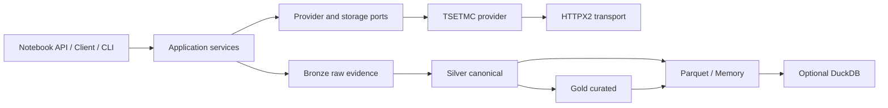

# Oxtapus 1.0

<p align="center">
  <a href="https://github.com/yghaderi/oxtapus/actions/workflows/ci.yml">
    
  </a>
  <a href="https://pypi.org/project/oxtapus/">
    
  </a>
  <a href="https://pypi.org/project/oxtapus/">
    
  </a>
  <a href="https://pypi.org/project/oxtapus/">
    
  </a>
</p>

<div dir="rtl" align="right">

Oxtapus یه بسته توسعه نرم‌افزاری (SDK) پایتون تایپ‌شده و مبتنی بر Polars برای داده‌های بازار
مالی ایرانه. نسخه 1.0 با یه معماری و رابط برنامه‌نویسی (API) کاملاً تازه ساخته شده؛ یعنی هم
برای کارهای سریع داخل نوت‌بوک جمع‌وجوره و هم زیرِ همین ظاهر ساده، سرویس‌های تایپ‌شده، قراردادهای
مشخص برای فراهم‌کننده‌ها، انتقال مقاوم HTTPX2 و خط لوله داده قابل‌بازپخش داره تا توی پروژه‌های
بزرگ‌تر هم بشه روش حساب کرد.

با Oxtapus می‌تونی به داده‌های عمومی منتشرشده در [TSETMC](https://tsetmc.com/) برای بورس
اوراق بهادار تهران (بورس تهران) و بازار سرمایه ایران دسترسی داشته باشی. این پروژه مستقل و
غیررسمیه و هیچ وابستگی یا تأییدی از طرف TSETMC نداره.

به زبان ساده، اگه دنبال یه کتابخونه پایتون برای دریافت و پردازش داده‌های TSETMC و بورس
تهران هستی، Oxtapus دقیقاً برای همین کار ساخته شده.

> حواست باشه سایت‌های منبع ممکنه هر لحظه و بدون اطلاع قبلی تغییر کنن. Oxtapus اطلاعات منبع
> و نسخه طرح‌واره رو ثبت می‌کنه، ولی در دسترس‌بودن همیشگی منبع یا اجازه بازنشر داده‌ها رو تضمین
> نمی‌کنه. اگه استفاده تجاری داری، حتماً اول
> [اطلاعیه منابع داده](DATA_SOURCE_NOTICE.md) رو بخون.

## نصب

برای نصب معمولی این دستور رو اجرا کن:

</div>

```bash
python -m pip install oxtapus
```

<div dir="rtl" align="right">

نسخه‌های 3.11 تا 3.14 پایتون پشتیبانی می‌شن. اگه یکپارچه‌سازی‌های اختیاری رو هم می‌خوای،
باید موقع نصب مشخصشون کنی:

</div>

```bash
python -m pip install 'oxtapus[arrow,pandas,duckdb,http2]'
```

<div dir="rtl" align="right">

## شروع سریع پنج‌دقیقه‌ای

برای گرفتن قیمت‌های روزانه چند نماد، همین چند خط کافیه:

</div>

```python
import oxtapus as ox

prices = ox.daily_prices(
    symbols=["فولاد", "خودرو"],
    start="2025-01-01",
    end="2026-01-01",
    progress=True,
)

print(prices.select("symbol", "trading_date", "close_price"))
```

<div dir="rtl" align="right">

تابع‌های ساده یه `polars.DataFrame` برمی‌گردونن. شکل‌های مختلف حروف فارسی و عربی به‌صورت
خودکار یکدست می‌شن، شناسه‌ها شفاف پیدا می‌شن، مقدارهای خالی واقعاً خالی می‌مونن، تلاش دوباره
فقط برای همون درخواست ناموفق انجام می‌شه و خطاهای پردازش گروهی هم قایم نمی‌شن.

اگه قراره چند بار درخواست بفرستی، بهتره یه کلاینت `Client` بسازی و همون رو نگه داری:

</div>

```python
from oxtapus import Client, Settings

settings = Settings(concurrency=4, requests_per_second=2, progress=True)
with Client(settings) as client:
    snapshot = client.market.market_watch(["equity", "etf"])
    result = client.market.fetch_daily_prices(["فولاد", "خودرو"])

print(result.failures)
print(result.lineage.to_dict())
```

<div dir="rtl" align="right">

نسخه ناهمگام (`async`) واقعی هم مستقیم با `await` سطح بالای Jupyter کار می‌کنه:

</div>

```python
from oxtapus import AsyncClient

async with AsyncClient() as client:
    prices = await client.market.daily_prices(["فولاد", "خودرو"])
```

<div dir="rtl" align="right">

Oxtapus خودش حلقه رویداد (`event loop`) رو راه نمی‌اندازه، تودرتو نمی‌کنه، از نو اجرا
نمی‌کنه و دستکاریش هم نمی‌کنه.

## رابط عمومی

از پکیج اصلی عمداً فقط `Client`، `AsyncClient`، `Settings`، `FetchResult`، `DataLayer`،
`daily_prices`، `market_watch`، `instrument_search` و `option_chain` در دسترس مستقیم هستن.
کلاس‌های داخلی فراهم‌کننده‌ها بخشی از رابط عمومی نیستن.

## معماری

</div>



<div dir="rtl" align="right">

برای تنظیمات، شواهد نقطه‌های پایانی، بازپخش داده، ذخیره‌سازی، قراردادهای طرح‌واره، تست و ساخت
فراهم‌کننده جدید، یه سر به [مستندات کامل](docs/index.md) بزن.

## توسعه پروژه

برای آماده‌کردن محیط توسعه و اجرای همه بررسی‌ها از این دستورها استفاده کن:

</div>

```bash
uv sync --all-extras --group dev
uv run ruff format --check .
uv run ruff check .
uv run pyright
uv run pytest -m "not live"
uv run lint-imports
uv run mkdocs build --strict
uv build
```

<div dir="rtl" align="right">

تست‌های معمولی کاملاً آفلاین اجرا می‌شن. تست‌های زنده اختیاری‌ان و با `pytest -m live`
اجرا می‌شن.

## حمایت از پروژه

اگه Oxtapus کارت رو راحت‌تر کرده و دوست داری توسعه متن‌بازش ادامه پیدا کنه، می‌تونی از
پروژه حمایت کنی.

[](https://daramet.com/yghaderi)

## مجوز

کد منبع Oxtapus با مجوز MIT منتشر شده. قوانین استفاده از داده‌های دریافتی جداست و به منبع
اصلی هر داده بستگی داره.

</div>
