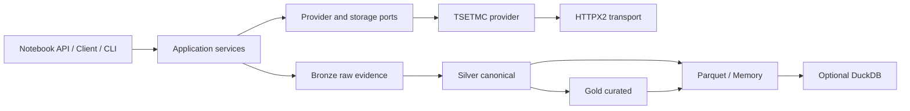

# Oxtapus 1.0

<p align="center">
  <a href="https://github.com/yghaderi/oxtapus/actions/workflows/ci.yml">
    
  </a>
  <a href="https://pypi.org/project/oxtapus/">
    
  </a>
  <a href="https://pypi.org/project/oxtapus/">
    
  </a>
  <a href="https://pypi.org/project/oxtapus/">
    
  </a>
</p>

Oxtapus is a typed, Polars-native Python SDK for Iranian financial market data. Version
1.0 is a clean architecture and API: a small notebook surface sits over the same typed
services, provider contracts, resilient HTTPX2 transport, and replayable data pipeline used
by larger applications.

Oxtapus provides an independent Python interface to public market data published through
[TSETMC](https://tsetmc.com/) for the Tehran Stock Exchange (TSE) and Iran's capital
market. It is not affiliated with or endorsed by TSETMC.

برای توسعه‌دهندگان فارسی‌زبان: Oxtapus کتابخانه پایتون دریافت و پردازش داده‌های
[TSETMC](https://tsetmc.com/)، بورس اوراق بهادار تهران (بورس تهران) و بازار سرمایه ایران
است.

> Upstream websites can change without notice. Oxtapus reports source/schema metadata but
> does not promise source availability or grant redistribution rights. Review
> [DATA_SOURCE_NOTICE.md](DATA_SOURCE_NOTICE.md) before commercial use.

## Install

```bash
python -m pip install oxtapus
```

Python 3.11–3.14 is supported. Optional integrations are installed explicitly:

```bash
python -m pip install 'oxtapus[arrow,pandas,duckdb,http2]'
```

## Five-minute quickstart

```python
import oxtapus as ox

prices = ox.daily_prices(
    symbols=["فولاد", "خودرو"],
    start="2025-01-01",
    end="2026-01-01",
    progress=True,
)

print(prices.select("symbol", "trading_date", "close_price"))
```

The simple functions return `polars.DataFrame`. Persian/Arabic Unicode variants are
normalized, identifiers are resolved explicitly, null values remain null, retries are scoped
to the failing request, and batch failures are not hidden.

Use a long-lived client when making several calls:

```python
from oxtapus import Client, Settings

settings = Settings(concurrency=4, requests_per_second=2, progress=True)
with Client(settings) as client:
    snapshot = client.market.market_watch(["equity", "etf"])
    result = client.market.fetch_daily_prices(["فولاد", "خودرو"])

print(result.failures)
print(result.lineage.to_dict())
```

Native async works directly with Jupyter top-level `await`:

```python
from oxtapus import AsyncClient

async with AsyncClient() as client:
    prices = await client.market.daily_prices(["فولاد", "خودرو"])
```

Oxtapus never starts, nests, restarts, or patches an event loop.

## Public surface

The root package intentionally exports `Client`, `AsyncClient`, `Settings`, `FetchResult`,
`DataLayer`, `daily_prices`, `market_watch`, `instrument_search`, and `option_chain`.
Provider implementation classes are internal.

## Architecture



See the [documentation](docs/index.md) for configuration, endpoint evidence, replay,
storage, schema contracts, testing, and provider development.

## Development

```bash
uv sync --all-extras --group dev
uv run ruff format --check .
uv run ruff check .
uv run pyright
uv run pytest -m "not live"
uv run lint-imports
uv run mkdocs build --strict
uv build
```

Ordinary tests are offline. Live canaries are opt-in with `pytest -m live`.

## Support the project

If Oxtapus makes your work easier, consider supporting its continued open-source
development.

[](https://daramet.com/yghaderi)

## License

Oxtapus source code is MIT-licensed. Upstream data is governed separately by its source.
