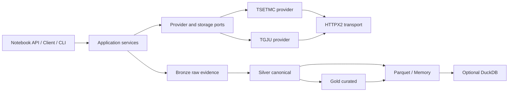

# Oxtapus 1.2

<p align="center">
  <a href="https://github.com/yghaderi/oxtapus/actions/workflows/ci.yml">
    
  </a>
  <a href="https://pypi.org/project/oxtapus/">
    
  </a>
  <a href="https://pypi.org/project/oxtapus/">
    
  </a>
  <a href="https://pypi.org/project/oxtapus/">
    
  </a>
</p>

<div align="right">

&#x2067;&#x2066;Oxtapus&#x2069; یه بستهٔ پایتون تایپ‌شده و مبتنی بر &#x2066;Polars&#x2069; برای داده‌های بازار
مالی ایرانه. شاخهٔ &#x2066;1.x&#x2069; با یه معماری و رابط برنامه‌نویسی کاملاً تازه ساخته شده؛ یعنی هم
برای کارهای سریع داخل نوت‌بوک جمع‌وجوره و هم زیرِ همین ظاهر ساده، سرویس‌های تایپ‌شده، قراردادهای
مشخص برای فراهم‌کننده‌ها، انتقال مقاوم &#x2066;HTTPX2&#x2069; و خط لوله داده قابل‌بازپخش داره تا توی
پروژه‌های بزرگ‌تر هم بشه روش حساب کرد.&#x2069;

&#x2067;با &#x2066;Oxtapus&#x2069; می‌تونی به داده‌های عمومی بورس اوراق بهادار تهران و بازار سرمایه ایران
از منبع &#x2066;[TSETMC](https://tsetmc.com/)&#x2069; دسترسی داشته باشی. این پروژه مستقل و غیررسمیه و
هیچ وابستگی یا تأییدی از طرف &#x2066;TSETMC&#x2069; نداره.&#x2069;

&#x2067;تاریخچهٔ قیمت دلار آزاد، دلار نیما، یورو، سکه امامی و نیم‌سکه هم از
&#x2066;[TGJU](https://www.tgju.org/)&#x2069; در دسترسه.&#x2069;

&#x2067;به زبان ساده، اگه دنبال یه کتابخونه پایتون برای دریافت و پردازش داده‌های بورس تهران هستی،
&#x2066;Oxtapus&#x2069; دقیقاً برای همین کار ساخته شده.&#x2069;

> &#x2067;حواست باشه سایت‌های منبع ممکنه هر لحظه و بدون اطلاع قبلی تغییر کنن. &#x2066;Oxtapus&#x2069; اطلاعات منبع
> و نسخه طرح‌واره رو ثبت می‌کنه، ولی در دسترس‌بودن همیشگی منبع یا اجازه بازنشر داده‌ها رو تضمین
> نمی‌کنه. اگه استفاده تجاری داری، حتماً اول
> [اطلاعیه منابع داده](https://github.com/yghaderi/oxtapus/blob/master/DATA_SOURCE_NOTICE.md) رو بخون.&#x2069;

## نصب

برای نصب معمولی این دستور رو اجرا کن:

</div>

```bash
python -m pip install oxtapus
```

<div align="right">

&#x2067;نسخه‌های &#x2066;3.11&#x2069; تا &#x2066;3.14&#x2069; پایتون پشتیبانی می‌شن. اگه
یکپارچه‌سازی‌های اختیاری رو هم می‌خوای، باید موقع نصب مشخصشون کنی:&#x2069;

</div>

```bash
python -m pip install 'oxtapus[arrow,pandas,duckdb,http2]'
```

<div align="right">

## شروع سریع پنج‌دقیقه‌ای

برای گرفتن قیمت‌های روزانه چند نماد، همین چند خط کافیه:

</div>

```python
import oxtapus as ox

prices = ox.tsetmc.daily_prices(
    symbols=["فولاد", "خودرو"],
    start="1403/10/12",
    end="1404/10/11",
    progress=True,
)

print(prices.select("symbol", "trading_date", "close_price"))
```

<div align="right">

برای گرفتن تاریخچهٔ دلار یا سکه هم فقط اسم دارایی رو بده:

</div>

```python
usd = ox.tgju.daily_prices("دلار", start="1402/10/11")
nima = ox.tgju.daily_prices("دلار نیما")
eur = ox.tgju.daily_prices("یورو")
emami = ox.tgju.daily_prices("سکه امامی")
half = ox.tgju.daily_prices("نیم‌سکه")
```

<div align="right">

&#x2067;&#x2066;`start`&#x2069; و &#x2066;`end`&#x2069; اختیاری‌ان. تاریخ شمسی رو می‌تونی با رقم فارسی،
عربی یا انگلیسی و در قالب‌های &#x2066;`YYYY-MM-DD`&#x2069;، &#x2066;`YYYY/MM/DD`&#x2069;،
&#x2066;`YYYY.MM.DD`&#x2069; یا &#x2066;`YYYYMMDD`&#x2069; بدی. &#x2066;Oxtapus&#x2069; با
&#x2066;`jdatetime`&#x2069; اون رو به میلادی تبدیل می‌کنه؛ تاریخ میلادی &#x2066;ISO&#x2069; هم
پذیرفته می‌شه. ورودی نامعتبر، همراه با همون مقدار واردشده و قالب‌های مجاز خطا می‌ده.&#x2069;

&#x2067;تابع‌های ساده یه &#x2066;`polars.DataFrame`&#x2069; برمی‌گردونن. شکل‌های مختلف حروف فارسی و عربی به‌صورت
خودکار یکدست می‌شن، شناسه‌ها شفاف پیدا می‌شن، مقدارهای گم‌شده واقعاً گم‌شده می‌مونن، تلاش مجدد
فقط برای همون درخواست ناموفق انجام می‌شه و خطاهای پردازش گروهی هم قایم نمی‌شن.&#x2069;

&#x2067;اگه قراره چند بار درخواست بفرستی، بهتره یه کلاینت &#x2066;`Client`&#x2069; بسازی و همون رو نگه داری:&#x2069;

</div>

```python
from oxtapus import Client, Settings

settings = Settings(concurrency=4, requests_per_second=2, progress=True)
with Client(settings) as client:
    snapshot = client.market.market_watch(["equity", "etf"])
    quote = client.market.quote("فولاد")
    order_book = client.market.market_depth("فولاد")
    activity = client.market.investor_activity("فولاد")
    identity = client.instruments.identity("فولاد")
    board = client.governance.board_members("فولاد")
    result = client.market.fetch_daily_prices(["فولاد", "خودرو"])

print(result.failures)
print(result.lineage.to_dict())
```

<div align="right">

&#x2067;نسخهٔ ناهمگام &#x2066;`async`&#x2069; هم مستقیم با &#x2066;`await`&#x2069; سطح بالای
&#x2066;Jupyter&#x2069; کار می‌کنه:&#x2069;

</div>

```python
from oxtapus import AsyncClient

async with AsyncClient() as client:
    prices = await client.market.daily_prices(["فولاد", "خودرو"])
```

<div align="right">

&#x2067;&#x2066;Oxtapus&#x2069; خودش حلقهٔ رویداد &#x2066;`event loop`&#x2069; رو راه نمی‌اندازه، تودرتو
نمی‌کنه، از نو اجرا نمی‌کنه و دستکاریش هم نمی‌کنه.&#x2069;

## رابط عمومی

&#x2067;میان‌برهای ساده بر اساس منبع گروه‌بندی شدن: داده‌های بورس تهران زیر
&#x2066;`ox.tsetmc`&#x2069; و داده‌های ارز و سکه زیر &#x2066;`ox.tgju`&#x2069;. برای نمونه، هر دو
منبع متد &#x2066;`daily_prices`&#x2069; دارن ولی مسیر فراخوانی مشخص می‌کنه داده از کجا میاد. کلاس‌های
داخلی فراهم‌کننده‌ها بخشی از رابط عمومی نیستن.&#x2069;

## معماری

</div>



<div align="right">

برای تنظیمات، شواهد نقطه‌های پایانی، بازپخش داده، ذخیره‌سازی، قراردادهای طرح‌واره، تست و ساخت
فراهم‌کننده جدید، یه سر به [مستندات کامل](https://yghaderi.github.io/oxtapus/) بزن.

## توسعه پروژه

برای آماده‌کردن محیط توسعه و اجرای همه بررسی‌ها از این دستورها استفاده کن:

</div>

```bash
uv sync --all-extras --group dev
uv run ruff format --check .
uv run ruff check .
uv run pyright
uv run pytest -m "not live"
uv run lint-imports
uv run sphinx-build -W --keep-going -b html docs docs/_build/html
uv build
```

<div align="right">

&#x2067;تست‌های معمولی کاملاً آفلاین اجرا می‌شن. تست‌های زنده اختیاری‌ان و با
&#x2066;`pytest -m live`&#x2069; اجرا می‌شن.&#x2069;

## حمایت از پروژه

&#x2067;اگه &#x2066;Oxtapus&#x2069; کارت رو راحت‌تر کرده و دوست داری توسعه متن‌بازش ادامه پیدا کنه،
می‌تونی از پروژه حمایت کنی.&#x2069;

[](https://daramet.com/yghaderi)

## مجوز

&#x2067;کد منبع &#x2066;Oxtapus&#x2069; با مجوز &#x2066;MIT&#x2069; منتشر شده. قوانین استفاده از داده‌های
دریافتی جداست و به منبع اصلی هر داده بستگی داره.&#x2069;

</div>
