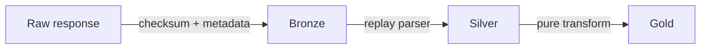

# Bronze, Silver, and Gold

Bronze is immutable source evidence: payload bytes, sanitized headers, request/run IDs,
timestamps, version evidence, checksum, and schema fingerprint. It contains enough context to
replay without a network request.

Silver unwraps envelopes, validates source types, reports additive fields, normalizes Persian
text and identifiers, applies canonical names/types, preserves nulls, deduplicates keys, and
attaches quality results.

Gold consumes Silver only. Current deterministic curated outputs include latest market
snapshots and flattened option chains.

